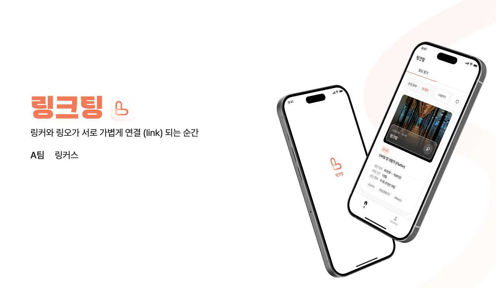
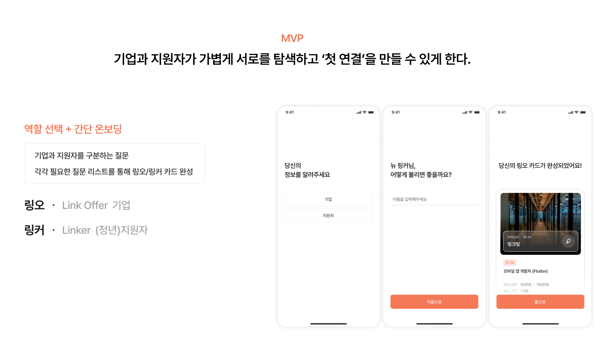
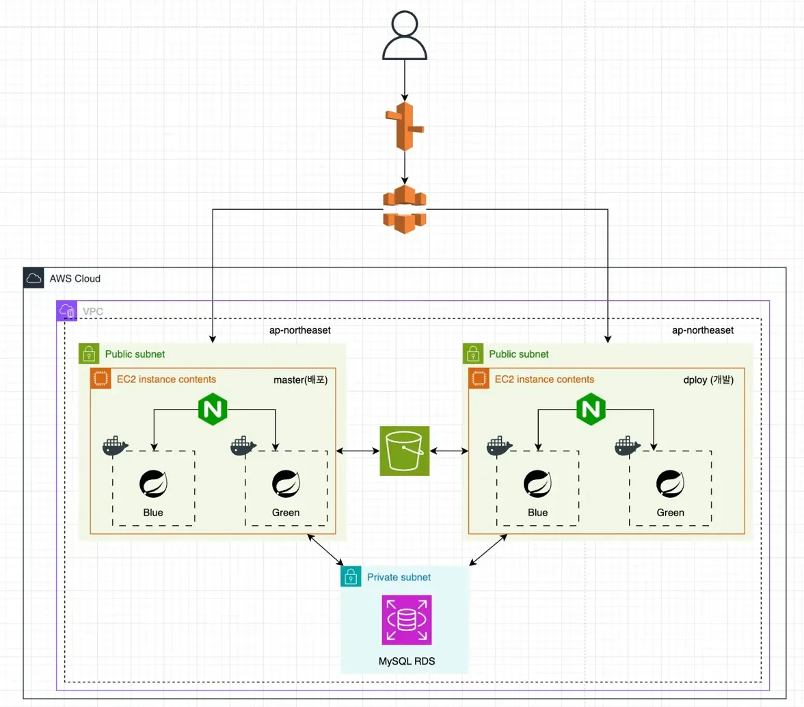

# LinkTing - 소개팅 UX를 적용한 외주 매칭 플랫폼

## 프로젝트 개요

**LinkTing**은 외주 시장의 심리적·정보적 장벽을 낮추고, 버튼 하나로 시작되는 간단한 연결 경험을 제공하는 플랫폼입니다.

- **개발 기간**: 2025년 11월 22-23일 (Nerdinery 해커톤)
- **팀 구성**: Backend 2명, Frontend (iOS) 2명, PM 1명, Design 1명
- **수상**: 🥇 대상 (1등)

### 서비스 특징

지원자(링커)는 본인의 스킬·경력·가능시간을 담은 "링커 카드"를 통해 자신에게 관심을 보인 기업의 오퍼를 빠르게 확인하고 응답할 수 있습니다.
기업(링오)은 필요한 기술과 조건에 맞는 링커를 직관적으로 탐색해 원하는 인재와 쉽게 연결될 수 있습니다.

## 기술 스택

- **Backend**: Java 21, Spring Boot 3.x
- **Database**: AWS RDS (MySQL)
- **Object Storage**: AWS S3
- **Compute**: Docker, AWS EC2
- **Web Server**: Nginx
- **CI/CD**: Jenkins
- **External API**: 소셜 로그인 (OAuth)

## 시스템 아키텍처

개발/배포 환경을 분리하여 Blue-Green 배포 전략을 통해 무중단 배포를 구현했습니다.

- **Master(프로덕션)**: 실제 서비스 환경
- **Deploy(개발)**: 개발 및 테스트 환경
- **Nginx**: 트래픽 라우팅 및 로드 밸런싱
  
## 주요 학습 및 경험
- 팀 프로젝트에서 API 설계 및 구현
- 해커톤 기간 중 배포 파이프라인 구축 및 트러블슈팅
- 소셜 로그인 레이트 리미팅 이슈 해결

